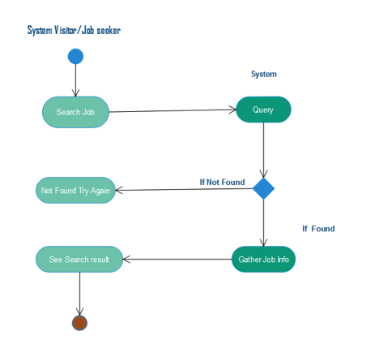
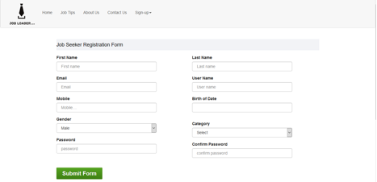

# Job-Finder
Job finder is a career management site in mobile and web platform. Job Finder aims to explore maximum benefits of the Internet. I believe our service will help the job seekers manage their career more efficiently. This site will also help employers solve many of the problems associated with traditional recruiting methods and allow them to save time and money. I did this project when I start to learn raw PHP and finally demonstrated this project as a Final year project.
Here I listed out some project related documents.
Use Case diagram for company user.

I.	Use Case diagram for company user.

I.	Use Case Diagram for Job seeker.

I.	Use Case Diagram for System supper admin.

I.	Use Case diagram for system admin.

1.	Activity diagram for post a new job:

1.	Activity diagram for Apply job:

1.	Activity diagram for search job:

 Entity relationship diagram.
 
I.	System Sequence Diagram for job seeker user:
 
  
  
  Screenshot
 
.....

.....
 
 .....
 
 .....
 
 .....
 
 .....
 
 .....
 
 .....
 
 .....
 
 .....
 
 .....
 
